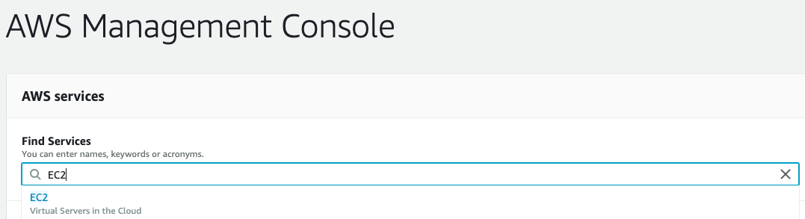
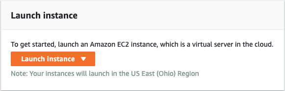
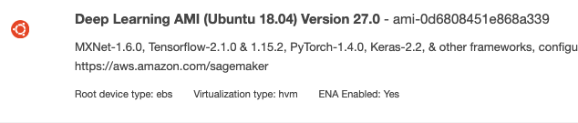
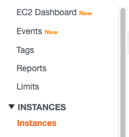
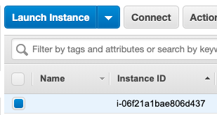
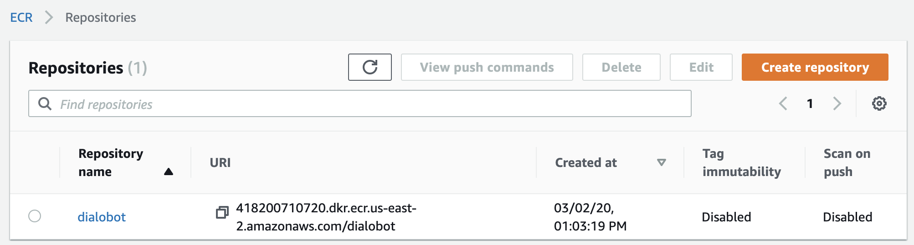
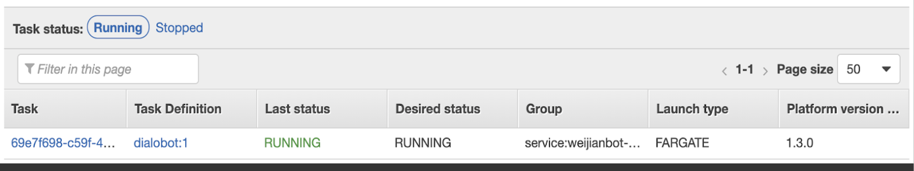

# Dialo

<!-- ```
User >>> Hello
Bot >>> Hello, nice to meet you!
User >>> Where are you from?
Bot >>> I'm from England, but I live in the US, USA
User >>> Which state are you in?
Bot >>> Alabama, my friend
User >>> What's the weather there?
Bot >>> It's cloudy
``` -->

<!-- Dialo implements 
  - a decoder ([source]()) for [DialoGPT](https://github.com/microsoft/DialoGPT), 
  - an interactive multiturn chatbot ([source]()), and 
  - a Telegram chatbot ([source]()).
  
The bot is built around [DialoGPT](https://github.com/microsoft/DialoGPT) - a large-scale pretrained dialogue response generation model trained by Microsoft, which was trained on 147M multi-turn dialogue from Reddit discussion thread. The human evaluation results indicate that its quility is comparable to human response quality under a single-turn conversation Turing test.

Since even with properly filtered Reddit dataset the model can generate toxic/inappropriate responses, the Microsoft team was unable to provide the decoding script. This repository implements the decoding script inspired by `run_generation.py` released earlier by Hugging Face. Moreover, it implements a Telegram bot that can be deployed locally, remotely, and even on Colab, and just makes testing fun. -->

## Problem Statement
In recent years, many chatbots have been deployed on the web and mobile platforms for the purpose of seeking information, site guidance, FAQ answering, etc. These chatbot are able to bring human-level performances within their task domain. However, when it comes to designing a chi-chat chatbot for the intention of making small-talks, it is challenging to build a chatbot that is flexible and intelligent enough to converse with users across all topics. 

In this project, we intended to develop a contextual chit-chat chatbot that has a user-friendly user interface and can easily be deployed on any cloud platform. 

### Input & Output
Input: a natural language sentence in English. (eg: Where are you from?)   
Output: a natural language sentence in English. (eg: I'm from England, but I live in the US, USA)

## Core Model
This robot is built around the model, [DialoGPT](https://github.com/microsoft/DialoGPT), which is based on the language model, [GPT2](https://openai.com/blog/better-language-models/). DialoGPT is a large-scale pretrained dialogue response generation model trained by Microsoft. Their [human evaluation results](https://github.com/microsoft/DialoGPT#human_eval) indicate that the response generated from DialoGPT is comparable to human response quality under a single-turn conversation Turing test.

## Deliverables
* Preprocessed Reddit forum data (27 GB) [Download](https://drive.google.com/open?id=1FiZh_NqaldbkA9aH1CoA0jIo84fgAGN5)
* GPT2 model decoder [View](https://github.com/Leevisir/Dialo/blob/master/gpt2bot/decoder.py)
* Code on running Dialo bot locally via terminal [View](https://github.com/Leevisir/Dialo/blob/master/gpt2bot/interactive_bot.py)
* Code on running Dialo bot on Telegram via Telegram API [View](https://github.com/Leevisir/Dialo/blob/master/gpt2bot/telegram_bot.py)
* Dockerfile for chatbot deployment [View](https://github.com/Leevisir/Dialo/blob/master/Dockerfile)
* Docker Image [View](https://hub.docker.com/repository/docker/leevisir/weijianbot)

## Run Chatbot (2 options)
Note: Both options 1 and 2 can be executed from a cloud service provider or from your local machine.
### Option 1 - Run with Docker:
### 1. Create a Telegram bot
Please follow this [link](https://tutorials.botsfloor.com/creating-a-bot-using-the-telegram-bot-api-5d3caed3266d) to create a Telegram bot. Please write down the token from the response of Telegram for later use.
```
Use this token to access the HTTP API:
2764xxxxxxxxxxxxxxxxxxxxxxxxxxxxxxxxx
```
### 2. Clone this repo and enter the repo
```
git clone https://github.com/Leevisir/Dialo.git
cd Dialo
```
### 3. Add the API token into the configuration file
```
# change this line in the file gpt2bot/chatbot.cfg
telegram_token = <YOUR_TOKEN_HERE>
```
### 4. Build the Docker image and run it
```
docker build -t dialo .
docker run dialo
```
Now the chatbot is running and you can use Telegram to chat with it.

### Option 2 - Run from code:
### 1. Follow step 1 - 3 in option 1
### 2. Create a virtual environment and activate it (if anaconda is not installed, please install it first following this [link](https://docs.anaconda.com/anaconda/install/))
```
conda create -n dialo python=3.7
conda activate dialo
```
### 4. Install all requirements
```
pip install -r requirements.txt
```
### 5. Run chatbot
```
cd gpt2bot
python telegram_bot.py
```

## Model Training
To retrain the DialoGPT model, please follow the following steps.
### 1. Installation
```
sudo apt-get install -y make wget gzip bzip2 xz-utils zstd
git clone https://github.com/microsoft/DialoGPT.git
cd DialoGPT
conda env create -f LSP-linux.yml -n LSP
conda activate LSP
```
To use fp16 training, please install apex by using commands below
```
conda activate LSP
git clone https://github.com/NVIDIA/apex
cd apex
git reset --hard 3d01e4a0a188cc8df54bc6e44cf5eb40ff6b4cc5
pip install -v --no-cache-dir --global-option="--cpp_ext" --global-option="--cuda_ext" .
```
### 2. Training Script
We used [demo.py](https://github.com/Leevisir/Dialo/blob/master/demo.py) for data preprocessing and model training.
Note that by default the demo.py will use a dummy data, please specify the Reddit training data by using option --data. Three options are available:dummy,small and full. The small Reddit data is around 140MB and the full Reddit data is more than 27GB. 
```
python demo.py --data small
python demo.py --data full
```
Note that the demo.py already includes the entire training pipeline:  
Download model -> Download data -> Preprocess data -> Run the training script  
Each step is separated with well written comments. Please feel free to look into demo.py to have full control on each configurable steps.  

### 3. Arguments for the training script
In the last step, the training script accept several arguments to tweak the training:

Argument | Type | Default value | Description
---------|------|---------------|------------
max\_seq\_length | `int` | `128` | Maximum number of tokens for each training instance. 
train\_input\_file | `str` | `""` | Path of the training dataset in a .db format
eval\_input\_file | `str` | `""` | Path of the validation set in a tsv format
continue_from | `int` | `0` | Resuming the training after a specified number of steps
fp16 | `boolean` | `True` | Whether to use 16-bits floating point for model training.
train\_batch\_size | `int` | `4` | Batch size for training
valid\_batch\_size | `int` | `4` | Batch size for validation
gradient\_accumulation\_steps | `int` | `2` | Accumulate gradients on several steps
learning\_rate | `float` | `1e-5` | Learning rate
lr\_schedule | `str` | `noam` | Learning rate schedule can be chosen from [`noam`, `noamwd`, `BERT`, `None`]
num\_optim\_steps | `int` | `1000000` | Number of training optimization steps
no_token_id | `boolean` | `True` | If set True, using all-zeros token-type embedding.


<!--## How to use the trained model-->
  
## Deploy Dialo Bot Via AWS

### 1. Create a Telegram bot

- Register a new Telegram bot from BotFather (see https://core.telegram.org/bots)

### 2. Deploy the bot (2 options)

#### a. Deployment via Amazon Elastic Compute Cloud (EC2)
<!-- First, search for EC2 in the AWS console search bar:

On the EC2 Dashboard, launch a new EC2 instance:
 -->
- First, launch a new EC2 instance
- Select the correct AMI:

- Then, select the correct Instance Type with GPU supports. Then one we chose was **p3.2xlarge**  
- After launching the EC2 instance, on the sidebar of the EC2 Dashboard, click **instance**:

- Select the instance just launched, click **connect** and you will seed the instructions on how to connect to the running instance using SSH. Open a terminal in your local machine and use SSH to connect to the instance.

- Do the steps of option 2 listed above on the instance.

#### b. Deployment via Amazon Elastic Container Service (ECS)
We primarily followed [this guide](https://towardsdatascience.com/how-to-deploy-a-docker-container-python-on-amazon-ecs-using-amazon-ecr-9c52922b738f) for deploying our docker image to AWS ECS. 

- First, we created a repository for this project on Amazon Elastic Cloud Registry (ECR) and pushed our docker image to the repository created.



- Then, we deployed the docker container on an ECS node.


<!--
#### c. Local Machine (via docker)
- Clone the repository
- Set your parameters such as API token in dialog.cfg
- To avoid re-downloading model files at each re-deployment, download the model files beforehand with
```
# cd gpt2bot/gpt2bot
python model.py
```
- Finally, deploy the container from the root folder
```
docker build -t gpt2bot . && docker run gpt2bot
```
-->

<!--
#### d. Local Machine (via code)
- Clone the repository
- Set your parameters such as API token in dialog.cfg
- Install packages listed in requirements.txt
- Run the script
```
# cd gpt2bot/gpt2bot
python telegram_bot.py
```
- To test the things out in the console, run
```
python interactive_bot.py
``
-->

### 3. Start chatting!


Just start texting. Append @gif for the bot to generate a GIF instead of text. To reset, type "Bye".


## References

- [Official DialoGPT implementation](https://github.com/microsoft/DialoGPT) and [DialoGPT paper](https://arxiv.org/abs/1911.00536)
- [Thread on current decoding scripts](https://github.com/microsoft/DialoGPT/issues/3)

You can wait for a full DialoGPT release and then replace the decoder.
